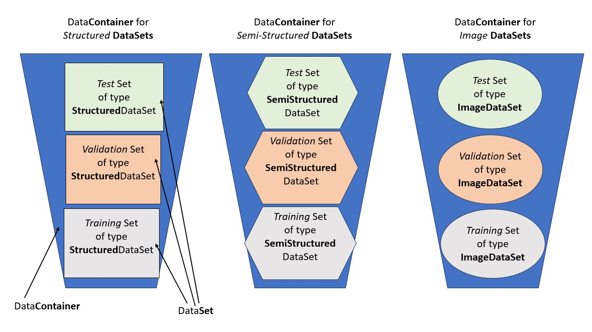

# Class diagrams

## Estimator

## Dataset

Creating a good abstraction for our data may be the most important part of this project, because this seems to be the biggest reason for the incompatibility between different frameworks, as well as the tight coupling of different components even *within* some of the major ML frameworks ([the worst of which I encountered with AWS Sagemaker](https://github.com/tloeber/email-classification#lessons-so-far)).

### Interfaces

Let's start by defining the *interfaces* we will implement. Actually, this is split into two different interfaces to account for the two different kind of operations we want to perform: *transforming between different formats*, and *splitting* the overall data. We will think of the former as simply the actual **DataSet** with which we will we working with, and the latter as a **container** for DataSets, because it contain the seperate subsets for training, validation, and testing. Let's first start by looking at this design using a basic visualization:

Below is the corresponding UML diagram. It shows the idea of data containers by leveraging *parameterized classes* (a.k.a. *templates*), which we can implement in Python using [Generics](https://mypy.readthedocs.io/en/stable/generics.html): The Data**Container**Interface provides a *contract for how we can retrieve the relevant subsets* (training, test, and validation set, as well as the whole dataset) *from our data abstraction*. However, it *does not know anything about these subsets* except how to retrieve each – from the data container's point of view, these could be any kinds of objects. It is thus similar to a collection (such as list, set, or dictionary) in Python. When using this inbuilt collections, we often want to restrict the type of elements we can put into our collection to only those that make sense in our domain. We would do this by using `list[string]` or `list[int]`, etc. We will use this same principle for modeling our data containers, with two further modifications: Firstly, since there is no inbuilt type for the datasets we want to put into our container, so we need to define our own custom class for data sets. Secondly, we want to be able to use *sub*types of dataset (such as *structured* dataset or *image* dataset) whenever we instantiate a concrete data containers. The challenge is that for a *given* data container, all its elements need to be of the *same* subtype: For example, if we are working with structured data, the training, test, and validation sets in our data container should all be of type StructuredDataSet, whereas if we work with image data, all subsets should be of type ImageDataSet.

In the absence of Generics, we could model this by making the DataContainerInterface an *abstract* interface that we do not implement directly, and instead create subclasses for data container interfaces for each specific dataset type (StructuredDataContainerInterface, SemiStructuredDataContainerInterface, ImageDataContainerInterface, etc.). I actually started out with this approach, but while this may seem on the surface like a simpler solution than to use Generics, it soon leads to greater complexity because it multiplies the number of necessary classes. This is especially true for a general framework such as ours, where we want to follow the famous design principle to depend on abstractions rather than concretions: Since we have to duplicate this structure for both interfaces and implementation, we end up with a BaseDataContainerInterface, StructuredDataContainerInterface, ImageDataContainerInterface,... as well as BaseDataContainer, StructuredDataContainer, ImageDataContainer, etc. Note that either way we will end up with this proliferation of classes for Data*Sets* - but by contrast to Data*Container*(Interface)s, it actually serves the important purpose of defining the specifics for that kind of data: The interfaces specify a specific contract from which formats a given kind of dataset can be created, to which formats it can be converted, etc.; and the implementations come up with a concrete way of achieving this behavior. However, there is no need to duplicate this logic at the level of the data container.

This is where Generics come in: They allow us to define the DataContainer simply as a container of objects that satisfy the BaseDataSetInterface. At the same time, however, Generics allow us to make sure that all the objects in the container are of the *same* subtype.

(Note that this interface does not contain a method to split the data, because this task can be handled by our data abstraction under the hood *if* necessary - and it will in fact not always be necessary, because we should allow our data container to be constructed from data that already comes pre-split.)

Also note that we will leave it up to the implementation whether the data container "has a" (is a composition or aggregation of) training set, validation set, and test set; or whether it simply "has a" single/combined dataset and fetches  the relevant subsets when requested. Our data container interface simply provides a contract for how we should be able to *retrieve the subsets* (as well as the complete dataset).

Now let's talk about the second interface, the Base**DataSet**Interface. It provides a contract for the kind of objects that our data container returns: Both the complete dataset as well as its subsets will implement the BaseDataSetInterface. *Its main purpose is to decouple our data abstraction from the specific way this data is represented (whether in persistent storage or in-memory)*. To that end, it contains two important methods:

- a *constructor*, which takes as its argument the data *format* from which to *instantiate* the dataset;
- a to_format() method, which allows us to *access* the data in the *format* that we supply as the argument.

This raises the question how we can constrain the permissible data formats to only those that make sense for a given *kind* of data? To this end, we use an Enum to model the possible datatypes that a given type of data could represent: For example, a structured dataset would be commonly stored on disk in parquet, csv, or JSON Lines format, or in-memory as a Pandas DataFrame. (Note that the *type in Python* corresponding to a given return format is not necessarily the same: For example, when we get our dataset in csv format, the return type would be `str`, or even `None` if we write to a file. We will deal with these details later).

### Implementation

Here is my proposal for how to implement the above interfaces: Our *container* class "has a" data splitter object (which contains concrete logic for how to split the data into training, validation, and test set, and uses information about the dependency relationship between the individual records to carry this out properly), as well as how to retrieve each of these subsets. By using an aggregation relationship, the splitter class is easily reusable. In particular, a given splitter can be used for different datasets: For example, the logic for performing a time-series split is the same for a structured dataset and an image dataset.

Note that we even require this splitter to be present in the case where the data already comes pre-split. Here, it still performs the important job of  retrieving the relevant subsets (including the whole dataset). Note also that this PreSplitDataSplitter will indeed implement the _split_data() method to satisfy the common interface, but since it should never be called, this method will always raise a (semantic) error.

# Pipeline

Finally, here is a complete ML pipeline:

Note that this is part of the design is least mature and lowest priority, because there already exist a number of good pipeline tools such as MLFlow Piperlines. Thus, I still need to decide to what extent the pipeline abstraction is even needed. However, a good *data* abstraction - which I am first focusing on developing – will be key in order to have minimal coupling between pipeline components. For example, this is not only necessary to decouple the preprocessor from the estimator, but also so we can easily re-use model quality evaluation (accuracy, etc.) and explainability tools.
